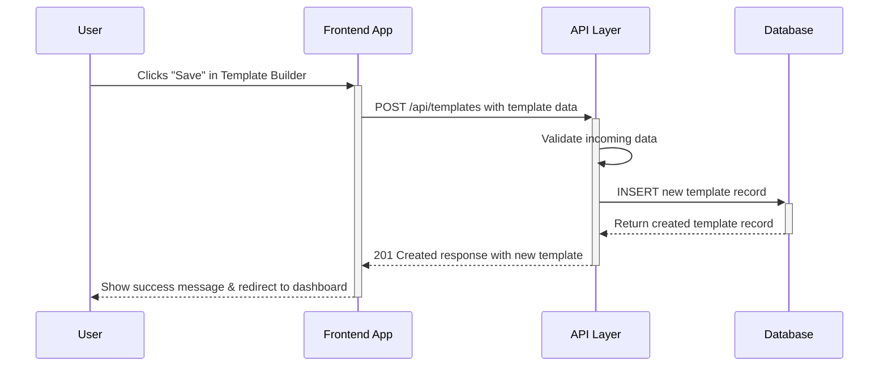

# Core Workflows

## Creating a New Checklist Template

```mermaid
sequenceDiagram
    participant User
    participant Frontend App
    participant API Layer
    participant Database

    User->>+Frontend App: Clicks "Save" in Template Builder
    Frontend App->>+API Layer: POST /api/templates with template data
    API Layer->>API Layer: Validate incoming data
    API Layer->>+Database: INSERT new template record
    Database-->>-API Layer: Return created template record
    API Layer-->>-Frontend App: 201 Created response with new template
    Frontend App-->>-User: Show success message & redirect to dashboard
``` 